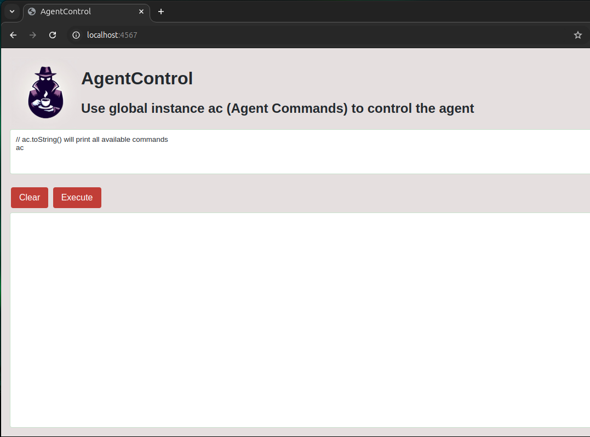

# Agent Control


With this agent you can debug and automate any Java Desktop UI from a groovy web console.  

# How does it work

Agent Control captures all Swing component creations and make them accessible.  
If you need to automate some action, you can use agent control to:
- Find the component you need to interact with
- Execute code using this component

# Example

For this class:  
```java
public class Main {
    public static void main(String... aArgs) {
        JFrame frame = new JFrame("Test Frame");
        JPanel panel = new JPanel();
        panel.add(new JLabel("Hello"));
        JButton ok = new JButton("OK");
        ok.addActionListener((event) -> JOptionPane.showMessageDialog(frame, "Clicked"));
        panel.add(ok);
        frame.getContentPane().add(panel);
        frame.setDefaultCloseOperation(WindowConstants.EXIT_ON_CLOSE);
        frame.pack();
        frame.setVisible(true);
    }
}
```

Run the jar with an agent by using the -javaagent argument:
`java -javaagent:agentControl.jar  -jar swingApp.jar`

You can get the component information on hovering:


Then open http://localhost:4567 on your browser:



You can execute ac.toString() to see all the methods you can use.  
ac is the instance containing all components.  

You can list the labels for all buttons using this groovy expression:  
`ac.getJButtons().collect {it.label}`  

You can then find the one with the right label:  
`ac.getJButtons().find {it.label == "OK"}`  

And finally, you can click on it:
`ac.clickOn(ac.getJButtons().find {it.label == "OK"})`  

If a component is hiding another one, you can also enable hiding on click:  
`ac.setHideComponentsOnClick(true)`  
And undo it later:  
`ac.unhideAllComponents()`

# Build

Run `mvn package assembly:single`, jar should be at \target  

# Run

Add the agent to the jar command.

java -javagent:/path/to/Agent -jar /path/to/jar

To operate open:  
```
http://localhost:4567/
```

Information about the component under the cursor shows on console.  

# License

Apache2.0